# Relatório de Análise dos Modelos de Machine Learning

## 1. Resumo Executivo

Este relatório apresenta a aplicação e a interpretação de quatro modelos de Machine Learning (aprendizado de máquina) sobre a base tratada de produção energética marítima: KNN, Regressão Linear Simples, Regressão Linear Múltipla e Regressão Logística. A análise foi desenvolvida a partir do arquivo `producao_maritima_tratada.csv`, que contém registros de produção marítima entre 2016 e 2026.

Em termos simples, o trabalho tenta responder a duas perguntas usando dados históricos de produção marítima: (1) "quanto óleo um registro deve apresentar, dado o que se sabe sobre gás, água, condensado e injeções daquele mesmo registro?" e (2) "esse registro apresenta produção positiva de óleo ou não?". A primeira pergunta é respondida por modelos de **regressão**, que estimam um número (um volume contínuo). A segunda é respondida por um modelo de **classificação**, que decide entre duas categorias (produziu ou não produziu).

O objetivo principal dos modelos de regressão foi prever a variável `producao_oleo_m3`, que representa o volume de óleo produzido em metros cúbicos (m³). Como essa variável é contínua — ou seja, pode assumir qualquer valor numérico dentro de um intervalo, e não apenas categorias —, os modelos KNN Regressor, Regressão Linear Simples e Regressão Linear Múltipla foram avaliados por métricas de erro e poder explicativo, como MSE, MAE, RMSE e R² (todas explicadas na Seção 6).

Para a Regressão Logística, foi criado um problema de classificação binária (duas classes apenas). A variável alvo passou a ser `produziu_oleo`, definida como 1 quando `producao_oleo_m3 > 0` e 0 quando `producao_oleo_m3 = 0`. Dessa forma, a regressão logística foi utilizada para responder se um registro apresenta ou não produção positiva de óleo, sem se preocupar em estimar a quantidade exata.

O projeto utilizou todos os 188.928 registros da base tratada — ou seja, nenhuma amostra foi descartada para acelerar o processamento. A separação entre treino e teste foi feita com 70% dos dados para treinamento (o modelo "estuda" esses dados) e 30% para avaliação (o modelo é testado em dados que nunca viu antes, o que simula uma situação real de uso). Os gráficos e tabelas gerados estão na pasta `resultados_ml`.

Principais conclusões:

- O KNN Regressor apresentou o melhor desempenho preditivo entre os modelos de regressão, com R² de 0,9016 e MAE de 2.582,79. Em palavras simples, esse modelo "errou menos" do que os demais ao prever o volume de óleo.
- A Regressão Linear Simples teve desempenho alto mesmo usando apenas uma variável explicativa, porque `producao_gas_associado_mm3` possui forte correlação com `producao_oleo_m3`. Ou seja, basta saber quanto gás associado foi produzido para já se ter uma boa pista sobre quanto óleo também foi.
- A Regressão Linear Múltipla melhorou a interpretabilidade do problema, mostrando quais variáveis possuem maior associação estatística com a produção de óleo — algo que o KNN, por não gerar uma equação, não permite fazer com a mesma clareza.
- A Regressão Logística apresentou desempenho excelente para classificar registros com e sem produção de óleo, com acurácia de 0,9205 e AUC de 0,9859 (ambos os termos explicados na Seção 6).
- A base apresenta forte assimetria — ou seja, os valores não se distribuem de forma equilibrada em torno da média —, com muitos registros de produção zero e alguns valores extremos de produção elevada. Isso deve ser considerado na interpretação dos erros e dos gráficos, e é discutido em detalhe na Seção 7.

## 2. Objetivo da Análise

O objetivo do trabalho foi aplicar os principais modelos estudados nas aulas a um conjunto real de dados, evitando exemplos artificiais ou simplificados demais. A análise buscou não apenas gerar métricas, mas também interpretar os resultados e discutir o comportamento dos modelos diante de uma base com características desafiadoras (muitos zeros, valores extremos, variáveis em escalas diferentes).

Do ponto de vista prático, estimar a produção de óleo (ou classificar se um poço produziu ou não) tem utilidade real para quem opera plataformas marítimas: ajuda a entender padrões produtivos, apoiar análises históricas e comparar comportamentos entre registros. Este trabalho não pretende substituir uma decisão operacional nem afirmar previsão antecipada de produção futura; ele demonstra, em escala acadêmica, como modelos estatísticos e de aprendizado de máquina podem ser aplicados a uma base real.

Os modelos avaliados foram:

- **KNN Regressor**: utilizado para prever um valor numérico contínuo de produção de óleo, comparando cada registro com os registros mais parecidos da base de treino (o nome "KNN" vem de _K-Nearest Neighbors_, ou "k vizinhos mais próximos").
- **Regressão Linear Simples**: utilizada para modelar a relação entre uma única variável explicativa e a produção de óleo, por meio de uma linha reta.
- **Regressão Linear Múltipla**: utilizada para modelar a produção de óleo a partir de várias variáveis explicativas ao mesmo tempo.
- **Regressão Logística**: utilizada para classificar se houve ou não produção positiva de óleo (apesar do nome "regressão", esse modelo resolve um problema de classificação, não de regressão numérica).

Essa separação é importante porque nem todos os modelos respondem ao mesmo tipo de pergunta. Os três primeiros modelos estimam **quanto** óleo foi produzido. A regressão logística estima a **probabilidade** de um registro pertencer à classe "produziu óleo", respondendo a uma pergunta de **sim ou não**.

## 3. Conceitos

**Variável alvo (ou variável dependente):** é a coisa que se quer prever. Neste trabalho, ela é `producao_oleo_m3` nos modelos de regressão e `produziu_oleo` no modelo de classificação.

**Variáveis explicativas (ou variáveis independentes, ou _features_):** são as informações usadas para tentar prever a variável alvo, como produção de gás, água, ano, e volumes de injeção.

**Conjunto de treino e conjunto de teste:** antes de avaliar um modelo, os dados são divididos em duas partes. O modelo "aprende" os padrões usando o conjunto de treino e depois é avaliado no conjunto de teste, que ele nunca viu antes. Isso é parecido com estudar para uma prova usando exercícios de um livro (treino) e depois fazer a prova de verdade com questões inéditas (teste): só assim sabemos se o aluno realmente aprendeu o conteúdo, e não apenas memorizou as respostas dos exercícios.

**Regressão vs. Classificação:** regressão estima um número (quanto), classificação decide entre categorias (qual classe).

**MSE (Erro Quadrático Médio):** mede o erro médio do modelo, mas elevando cada erro ao quadrado antes de fazer a média. Isso faz com que erros grandes pesem muito mais do que erros pequenos. Um exemplo numérico aparece na Seção 6.

**RMSE (Raiz do Erro Quadrático Médio):** é a raiz quadrada do MSE. A vantagem é que ela volta a ficar na mesma unidade da variável alvo (metros cúbicos), o que facilita a interpretação.

**MAE (Erro Absoluto Médio):** mede o erro médio do modelo sem elevar ao quadrado, apenas usando o valor absoluto (sem sinal) de cada erro. Por isso, é menos sensível a valores extremos do que o MSE.

**R² (coeficiente de determinação):** indica a proporção da variação da variável alvo que o modelo conseguiu explicar, em uma escala que vai (em geral) de 0 a 1. Um R² de 0,90, por exemplo, costuma ser interpretado como "o modelo explica 90% da variação observada nos dados".

**R² ajustado:** é uma versão do R² que leva em conta a quantidade de variáveis explicativas usadas. Ele existe porque é possível aumentar artificialmente o R² apenas adicionando mais variáveis ao modelo, mesmo que elas não ajudem de verdade. O R² ajustado "penaliza" essa prática, só aumentando se a nova variável realmente contribuir.

**Padronização (StandardScaler):** é uma transformação que coloca todas as variáveis na mesma escala (média 0 e desvio padrão 1). Modelos que calculam distância entre registros, como o KNN, precisam disso: sem padronização, uma variável medida em milhões dominaria o cálculo da distância só por ter números maiores, mesmo que não seja a mais importante.

**Validação cruzada (k-fold):** é uma técnica para testar um modelo de forma mais confiável. Em vez de separar os dados de treino em apenas um pedaço para "treinar" e outro para "validar", a técnica divide os dados em vários grupos (_folds_), treina o modelo em parte dos grupos e valida nos restantes, repetindo esse processo várias vezes e alternando os grupos. É como perguntar a opinião de vários grupos de pessoas diferentes antes de tomar uma decisão, em vez de confiar na opinião de um único grupo, que pode não ser representativo.

**Hiperparâmetro:** é uma configuração do modelo que precisa ser escolhida antes do treinamento (o modelo não a aprende sozinho a partir dos dados). O número `k` do KNN é um hiperparâmetro: precisa ser definido de antemão, e a validação cruzada ajuda a escolher um bom valor para ele.

**Erro padrão:** mede a precisão da estimativa de um coeficiente. Erros padrão menores indicam estimativas mais confiáveis.

**p-valor:** indica a probabilidade de se observar um efeito tão forte quanto o medido (ou mais forte) só por acaso, caso esse efeito não existisse de fato. Em geral, p-valores muito baixos (por exemplo, menores que 0,05) são interpretados como evidência de que a relação observada não é apenas coincidência. p-valores altos indicam que não há evidência estatística forte de que aquela variável realmente influencia o resultado.

**Acurácia:** proporção total de classificações corretas (sejam elas da classe 0 ou da classe 1).

**Precisão:** dos registros que o modelo classificou como positivos, quantos realmente eram positivos. Em outras palavras, mede a "confiabilidade" do alarme positivo do modelo.

**Recall (sensibilidade):** dos registros que realmente eram positivos, quantos o modelo conseguiu identificar. Mede a "capacidade de não deixar passar" casos positivos.

**F1-score:** uma média que combina precisão e recall, útil quando se quer um único número que resuma o equilíbrio entre os dois.

**AUC (área sob a curva ROC):** mede a capacidade do modelo de separar as duas classes em diferentes limiares de decisão. Quanto mais perto de 1, melhor o modelo separa quem é de uma classe de quem é da outra; 0,5 equivale a um modelo que classifica praticamente por sorteio.

**Overfitting e underfitting:** _overfitting_ (sobreajuste) ocorre quando o modelo memoriza tanto os dados de treino que perde a capacidade de generalizar para dados novos. _Underfitting_ (subajuste) é o oposto: o modelo é tão simples que não consegue capturar nem os padrões básicos dos dados. Esses dois conceitos são retomados na Seção 13.

## 4. Base de Dados

A base utilizada foi `producao_maritima_tratada.csv`. Ela possui dados consolidados de produção marítima divulgados pela Agência Nacional do Petróleo, Gás Natural e Biocombustíveis (ANP), com informações de produção de óleo, gás, água, condensado e variáveis de injeção (processos em que fluidos são bombeados de volta para o reservatório, geralmente para manter a pressão e estimular a produção).

Características principais:

| Característica                            |              Valor |
| ----------------------------------------- | -----------------: |
| Total de registros                        |            188.928 |
| Período                                   |        2016 a 2026 |
| Variável alvo da regressão                | `producao_oleo_m3` |
| Registros com produção zero               |             96.443 |
| Registros com produção positiva           |             92.485 |
| Percentual de registros com produção zero |             51,05% |

Vale destacar que cada linha da base representa um poço (ou instalação) em um determinado mês, e não uma plataforma "fixa" ao longo de todo o período. Isso explica, em parte, por que mais da metade dos registros têm produção de óleo igual a zero: um poço pode estar em manutenção, pode produzir apenas gás não associado (gás que não vem misturado ao óleo), ou pode ainda não ter entrado em operação plena naquele mês. Essas são explicações plausíveis com base no contexto do setor, não conclusões definitivas extraídas diretamente dos dados.

A variável `producao_oleo_m3` possui muitos valores iguais a zero. Isso significa que a base mistura dois comportamentos: registros sem produção de óleo e registros com volumes positivos, alguns deles muito altos. Esse ponto é decisivo para entender por que os gráficos possuem concentração próxima de zero e por que os resíduos (a diferença entre o valor real e o valor previsto pelo modelo) aumentam em valores mais altos.

Resumo estatístico da produção de óleo:

| Medida                  | Valor aproximado |
| ----------------------- | ---------------: |
| Quantidade de registros |          188.928 |
| Média                   |         8.965,90 |
| Desvio padrão           |        24.896,67 |
| Mínimo                  |             0,00 |
| 1º quartil              |             0,00 |
| Mediana                 |             0,00 |
| 3º quartil              |         4.577,88 |
| Percentil 90            |        22.811,03 |
| Percentil 95            |        58.475,21 |
| Percentil 99            |       129.864,30 |
| Máximo                  |       276.466,01 |

A média é muito maior que a mediana. Como a mediana é zero, pelo menos metade dos registros tem produção nula ou muito baixa. Já a média é "puxada para cima" por registros de produção elevada — um efeito parecido com o que acontece ao calcular a renda média de um grupo de pessoas quando uma ou duas delas ganham muito mais que as demais: a média deixa de representar bem o "caso típico". Isso caracteriza uma distribuição assimétrica à direita, com cauda longa (muitos valores baixos e poucos valores muito altos esticando a distribuição para a direita).

## 5. Preparação dos Dados e Metodologia

Antes da modelagem, as colunas numéricas foram convertidas para formato numérico (alguns valores podem ter chegado como texto, por exemplo). Valores ausentes foram preenchidos com zero. Essa escolha faz sentido no contexto desta base, pois campos vazios em variáveis de produção ou injeção normalmente indicam ausência daquele tipo de volume no registro (por exemplo, um poço que não recebe injeção de polímeros simplesmente não tem nada a registrar naquela coluna, e não um "dado perdido" que precisaria ser estimado).

As colunas sem variação foram removidas automaticamente. Uma coluna "sem variação" é aquela em que todos os registros têm exatamente o mesmo valor — geralmente zero, neste caso. Esse tipo de coluna não ajuda nenhum modelo, porque ela é incapaz de diferenciar um registro de outro (é como tentar usar a altura de um grupo de pessoas para explicar alguma coisa, quando todas elas têm exatamente a mesma altura: essa variável simplesmente não carrega nenhuma informação útil). Além disso, em modelos lineares, variáveis constantes podem causar instabilidade numérica ou coeficientes sem interpretação útil. Nesta execução, as colunas removidas foram:

- `injecao_outros_fluidos_m3`;
- `injecao_vapor_agua_t`.

Foram utilizadas as seguintes variáveis explicativas depois da remoção das constantes:

- `ano`;
- `producao_condensado_m3`;
- `producao_gas_associado_mm3`;
- `producao_gas_nao_associado_mm3`;
- `producao_agua_m3`;
- `injecao_gas_mm3`;
- `injecao_agua_recuperacao_secundaria_m3`;
- `injecao_agua_descarte_m3`;
- `injecao_gas_carbonico_mm3`;
- `injecao_nitrogenio_mm3`;
- `injecao_polimeros_m3`.

A base foi dividida em treino e teste com proporção 70/30. Assim, aproximadamente 132.249 registros foram usados para treinamento e 56.679 para teste. Como explicado no glossário (Seção 3), essa divisão funciona como simulados de prova: o modelo "estuda" com 70% dos dados e depois é avaliado com os 30% restantes, que ele nunca viu, para que a avaliação seja honesta e não apenas uma medida de memorização.

No KNN e na Regressão Logística, foi utilizado `StandardScaler` (a padronização explicada na Seção 3). No KNN, essa padronização é essencial porque o modelo calcula distâncias: uma variável com valores numéricos muito grandes (como `injecao_agua_recuperacao_secundaria_m3`, que pode chegar a milhares) poderia dominar a distância em relação a uma variável de valores pequenos, mesmo que ambas fossem relevantes. Na Regressão Logística, a padronização ajuda a estabilidade da otimização e torna a regularização padrão do `scikit-learn` mais equilibrada entre variáveis em escalas diferentes. Já a Regressão Linear Simples e a Múltipla não dependem dessa padronização para gerar previsões corretas, porque a equação da reta se ajusta automaticamente à escala de cada variável — por isso elas foram treinadas com os dados em sua escala original.

No KNN, a escolha do melhor valor de `k` foi feita por validação cruzada com valores ímpares entre 1 e 15. Em classificadores KNN, valores ímpares ajudam a reduzir empates de votação; neste trabalho, como o KNN foi usado como regressor, a escolha de valores ímpares serviu principalmente para testar uma grade simples e tradicional de vizinhos. Para manter o custo computacional viável — calcular distâncias entre milhares de registros, repetidas vezes, é uma tarefa pesada —, a validação de `k` foi realizada em uma amostra controlada do conjunto de treino, e não na base de treino inteira. Depois de escolhido o melhor `k`, o modelo final foi treinado e avaliado na divisão treino/teste da base completa, sem qualquer amostragem. Essa decisão é revisitada de forma crítica na Seção 13.

Vale registrar também uma observação metodológica importante: a divisão entre treino e teste foi feita de forma aleatória (por meio de `random_state` fixo, para garantir que o experimento possa ser repetido com o mesmo resultado), e não por ordem cronológica. Como a base possui uma estrutura temporal (`ano`, `mes_ano`), isso significa que registros de meses futuros podem ter entrado no treino enquanto registros de meses passados podem ter ficado no teste. Essa escolha é comum em trabalhos introdutórios de Machine Learning e não invalida os resultados aqui apresentados, mas representa uma simplificação que merece atenção em aplicações reais, como discutido na Seção 13.

## 6. Métricas Utilizadas

### 6.1 Métricas dos Modelos de Regressão

Para KNN, Regressão Linear Simples e Regressão Linear Múltipla, foram usadas as seguintes métricas:

- **MSE**: erro quadrático médio. Penaliza mais fortemente erros grandes.
- **RMSE**: raiz quadrada do MSE. Fica na mesma unidade da variável alvo, ou seja, m³.
- **MAE**: erro absoluto médio. Indica o erro médio em m³ e é menos sensível a valores extremos que o MSE.
- **R²**: coeficiente de determinação. Mede a proporção da variação da variável alvo explicada pelo modelo.
- **R² ajustado**: usado na regressão múltipla para considerar a quantidade de variáveis explicativas.

Para tornar a diferença entre MSE e MAE mais concreta, considere um exemplo simples (com números ilustrativos, não extraídos da base real): um modelo erra por 10, 10 e 100 unidades em três previsões. O MAE seria a média simples desses erros, (10+10+100)/3 ≈ 40. Já o MSE elevaria cada erro ao quadrado antes de tirar a média: (100+100+10.000)/3 ≈ 3.400, e o RMSE (raiz desse valor) ficaria em torno de 58,3. Note como o único erro grande (100) "domina" o MSE e o RMSE, enquanto o MAE continua relativamente próximo dos dois erros pequenos. É exatamente esse comportamento que explica por que, na nossa base — que tem valores extremos de produção —, o RMSE tende a ficar bem mais alto do que o MAE em todos os modelos.

Um R² próximo de 1 indica bom poder explicativo. No entanto, R² alto não significa que o modelo seja perfeito. Ele deve ser analisado junto com os erros, gráficos e características da base.

### 6.2 Métricas do Modelo de Classificação

Para a Regressão Logística, foram usadas:

- **Acurácia**: proporção total de classificações corretas.
- **Precisão**: entre os registros previstos como positivos, quantos realmente eram positivos.
- **Recall**: entre os registros realmente positivos, quantos foram encontrados pelo modelo.
- **F1-score**: média harmônica entre precisão e recall.
- **AUC**: área sob a curva ROC, indicando a capacidade de separação entre classes.
- **Matriz de confusão**: mostra verdadeiros positivos, verdadeiros negativos, falsos positivos e falsos negativos.

Um exemplo curto ajuda a fixar a diferença entre precisão e recall: imagine um filtro de spam. A precisão responde "dos e-mails que o filtro marcou como spam, quantos eram realmente spam?". O recall responde "dos e-mails que realmente eram spam, quantos o filtro conseguiu identificar?". Um filtro pode ter precisão altíssima sendo bastante seletivo (só marca como spam quando tem certeza absoluta), mas, ao ser tão cauteloso, pode deixar passar vários spams de verdade (recall mais baixo). É exatamente esse padrão que aparece nos resultados da Regressão Logística, discutidos na Seção 11.

A acurácia isolada pode ser enganosa em classificação, principalmente quando as duas classes não têm o mesmo tamanho. Por isso, a avaliação da regressão logística foi feita com várias métricas complementares.

## 7. Análise Exploratória dos Dados

A análise exploratória é a etapa em que se "conhece" a base antes de treinar qualquer modelo — olhando gráficos e estatísticas simples para entender o comportamento dos dados e antecipar dificuldades.

### 7.1 Histograma da Produção de Óleo

Gráfico gerado: `resultados_ml/histograma_producao_oleo.png`

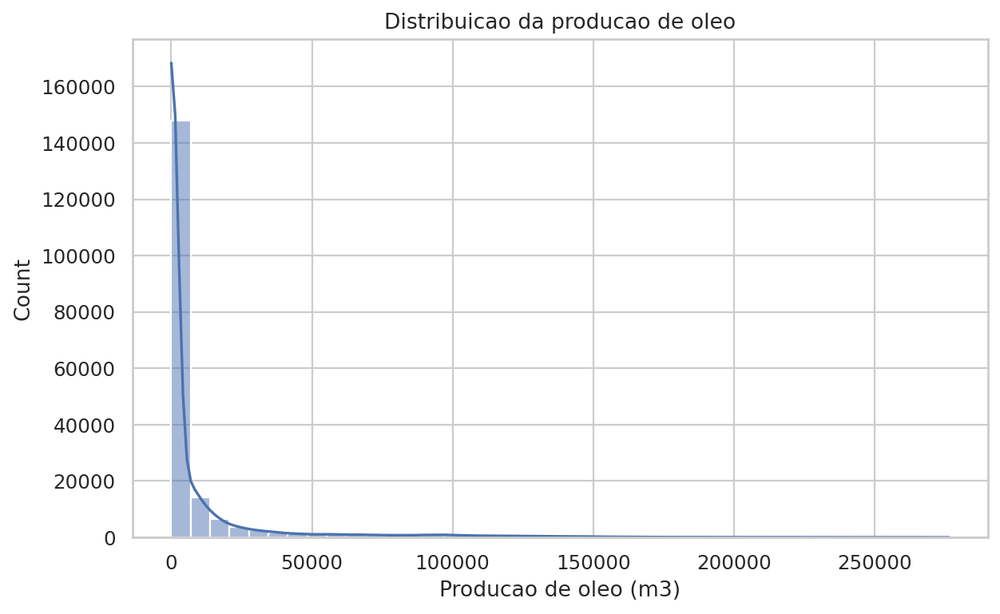

O histograma mostra uma forte concentração de registros com produção baixa ou igual a zero. Esse resultado confirma a estatística da base: 51,05% dos registros apresentam produção nula de óleo.

Também é possível perceber que a distribuição não se aproxima de uma distribuição normal (a clássica "curva de sino", simétrica em torno da média). Ela é assimétrica e possui cauda longa, como já discutido na Seção 4. Isso impacta principalmente os modelos de regressão, pois poucos valores extremos podem aumentar bastante o MSE, como demonstrado no exemplo numérico da Seção 6.

Por esse motivo, a interpretação do MAE se torna especialmente importante. Enquanto o MSE aumenta muito diante de erros grandes, o MAE informa um erro médio mais direto em metros cúbicos, menos distorcido pelos poucos registros de produção muito alta.

### 7.2 Heatmap de Correlação

Gráfico gerado: `resultados_ml/heatmap_correlacao.png`

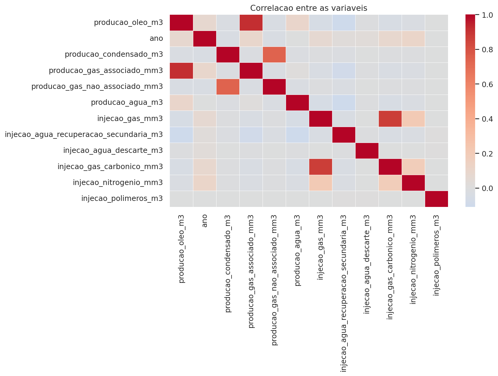

Um _heatmap_ (mapa de calor) de correlação é uma forma visual de mostrar o quanto cada par de variáveis se move "junto": cores mais intensas indicam relações mais fortes, e o sinal (positivo ou negativo) indica se as variáveis crescem juntas ou em direções opostas. A correlação varia de -1 (relação inversa perfeita) a +1 (relação direta perfeita), passando por 0 (nenhuma relação linear aparente).

A maior correlação com `producao_oleo_m3` ocorreu em `producao_gas_associado_mm3`, com valor aproximado de 0,9178 — uma correlação bastante forte.

Principais correlações com a produção de óleo:

| Variável                                 | Correlação com `producao_oleo_m3` |
| ---------------------------------------- | --------------------------------: |
| `producao_gas_associado_mm3`             |                            0,9178 |
| `producao_agua_m3`                       |                            0,0986 |
| `ano`                                    |                            0,0738 |
| `injecao_agua_recuperacao_secundaria_m3` |                           -0,1076 |
| `injecao_gas_mm3`                        |                           -0,0482 |
| `injecao_gas_carbonico_mm3`              |                           -0,0398 |
| `producao_gas_nao_associado_mm3`         |                           -0,0316 |

A relação entre óleo e gás associado é tecnicamente coerente. O gás associado costuma ocorrer junto ao óleo em reservatórios petrolíferos — por isso o nome "associado". Portanto, registros com alta produção de óleo tendem a apresentar alta produção de gás associado, quase como dois efeitos de uma mesma causa subjacente (a quantidade de hidrocarbonetos disponível naquele reservatório).

Essa correlação forte também explica por que a regressão linear simples teve bom desempenho usando apenas `producao_gas_associado_mm3`. Entretanto, ela também exige cuidado: essa variável está muito próxima do processo físico de produção de óleo, então modelos que a utilizam tendem a ter desempenho elevado quase "por definição", e não necessariamente porque descobriram uma relação sutil ou não óbvia nos dados.

## 8. Modelo 1: KNN Regressor

### 8.1 Descrição do Modelo

O KNN (_K-Nearest Neighbors_, ou "k vizinhos mais próximos") foi utilizado como regressor. A ideia central é simples: para prever a produção de óleo de um registro novo, o modelo procura, dentro do conjunto de treino, os `k` registros mais "parecidos" com ele (com valores de gás, água e injeções mais próximos) e calcula a média da produção de óleo desses vizinhos. É um pouco como perguntar a opinião de pessoas com perfil parecido com o seu antes de tomar uma decisão, em vez de seguir uma fórmula fixa.

Diferente dos modelos de regressão linear, o KNN não gera uma equação com coeficientes interpretáveis: ele simplesmente "consulta" os dados de treino a cada nova previsão. Por isso, ele é chamado de modelo _não paramétrico_ ou _baseado em instâncias_: a "memória" do modelo é o próprio conjunto de treino, e não um conjunto fixo de parâmetros.

O funcionamento do KNN depende de três elementos principais:

- a medida de distância entre os registros (a distância euclidiana, a mesma usada para medir distância entre pontos em um mapa, mas em várias dimensões ao mesmo tempo);
- o número de vizinhos `k`;
- a escala das variáveis.

Como as variáveis possuem escalas diferentes (algumas em milhares, outras em unidades), foi aplicado `StandardScaler`. Isso evita que variáveis com valores maiores dominem o cálculo de distância apenas por terem números absolutos mais altos.

### 8.2 Escolha do Valor de k

Gráfico gerado: `resultados_ml/knn_mse_por_k.png`

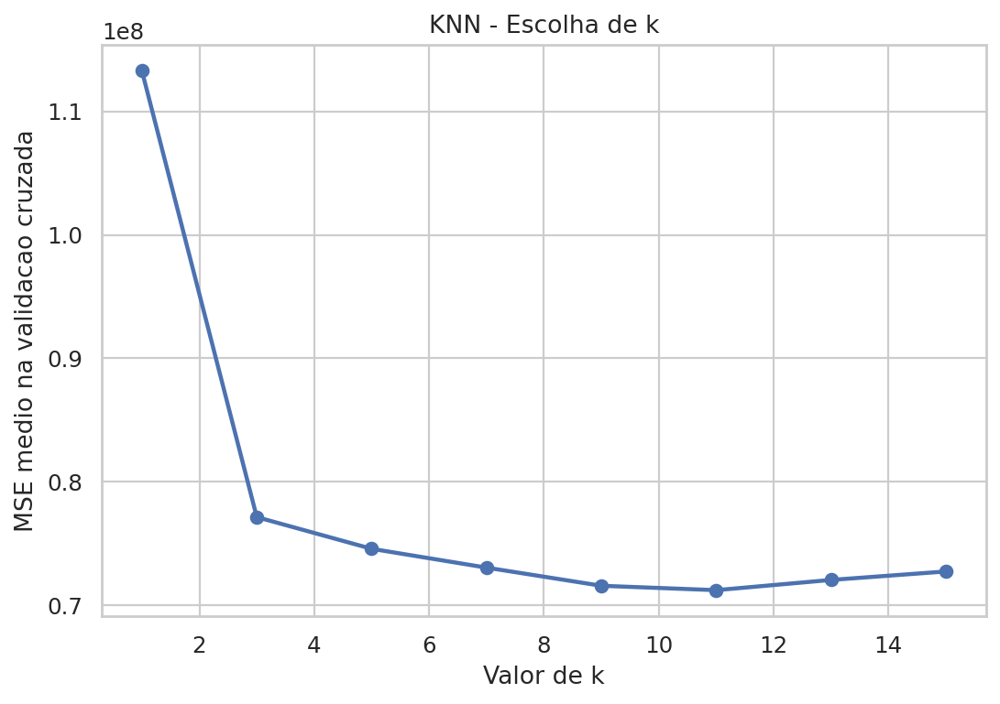

Escolher um bom valor de `k` envolve um equilíbrio. Com `k` muito pequeno (por exemplo, `k=1`), a previsão depende de um único vizinho, o que torna o modelo muito sensível a ruído: se esse único vizinho for um caso atípico, a previsão sai distorcida. Com `k` muito grande, o modelo passa a fazer a média de tantos vizinhos que a previsão fica "borrada", perdendo detalhes locais importantes — como perguntar a opinião de praticamente todo mundo e acabar com uma resposta genérica demais. Por isso, o valor ideal de `k` costuma estar em algum ponto intermediário, e a validação cruzada (explicada na Seção 3) ajuda a encontrá-lo de forma objetiva, em vez de escolhê-lo arbitrariamente.

Foram testados valores ímpares de `k` entre 1 e 15. A métrica usada na validação cruzada foi o MSE médio.

Resultados da validação cruzada:

|   k | MSE médio aproximado |
| --: | -------------------: |
|   1 |       113.280.279,21 |
|   3 |        77.144.368,30 |
|   5 |        74.577.281,73 |
|   7 |        73.053.243,79 |
|   9 |        71.584.494,12 |
|  11 |        71.228.696,41 |
|  13 |        72.056.261,79 |
|  15 |        72.741.601,27 |

O melhor resultado foi obtido com `k = 11`. O comportamento da tabela é coerente com a teoria do KNN, descrita acima: o erro cai rapidamente entre `k=1` e `k=9`, atinge o ponto mais baixo em `k=11` e volta a subir levemente depois disso, exatamente o formato de "U" esperado quando se equilibra sensibilidade a ruído (k pequeno) com perda de detalhe local (k grande).

### 8.3 Resultados do KNN

| Métrica |         Valor |
| ------- | ------------: |
| MSE     | 60.163.973,53 |
| RMSE    |      7.756,54 |
| MAE     |      2.582,79 |
| R²      |        0,9016 |

O KNN foi o melhor modelo de regressão. O R² de 0,9016 indica que o modelo explicou aproximadamente 90,16% da variação da produção de óleo no conjunto de teste — um resultado expressivo para uma base com tanta dispersão de valores.

O MAE de 2.582,79 significa que, em média, as previsões erram cerca de 2.583 m³ de óleo. Considerando que a base possui registros que chegam a mais de 276 mil m³, esse erro médio é relativamente baixo, equivalente a menos de 1% do valor máximo observado.

O RMSE de 7.756,54 é maior que o MAE — quase três vezes maior, na verdade. Como explicado no exemplo numérico da Seção 6, essa diferença grande entre RMSE e MAE é o "sinal" de que existem alguns erros bem maiores que a média, provavelmente associados aos registros de produção mais elevada.

### 8.4 Gráfico Real vs. Previsto

Gráfico gerado: `resultados_ml/knn_real_vs_previsto.png`

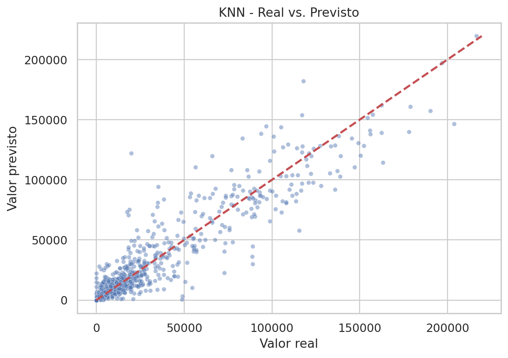

O gráfico compara os valores reais com os valores previstos. Quanto mais próximos os pontos estiverem da linha diagonal (que representa o "acerto perfeito", onde previsto = real), melhor é o ajuste.

O KNN apresentou bom alinhamento geral. Isso indica que o modelo conseguiu capturar padrões locais na base. Ainda assim, alguns pontos de alta produção ficam mais afastados da linha ideal, o que é esperado em bases com valores extremos: há simplesmente menos exemplos de produção muito alta para o modelo "aprender" com eles.

### 8.5 Gráfico de Resíduos

Gráfico gerado: `resultados_ml/knn_residuos.png`

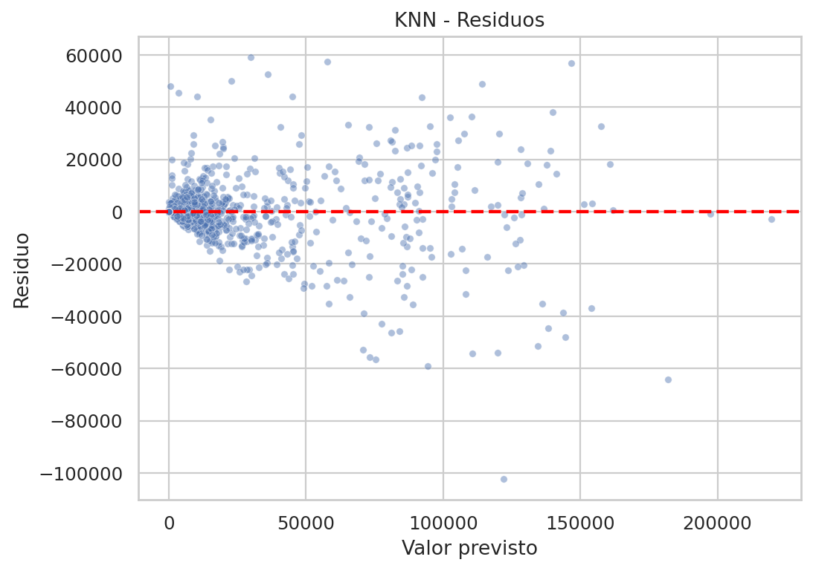

O gráfico de resíduos mostra a diferença entre valor real e valor previsto, plotada contra o valor previsto. O ideal é que os resíduos fiquem distribuídos em torno de zero, sem formar nenhum padrão visível (uma "nuvem" sem formato definido).

No KNN, os resíduos ficam relativamente concentrados perto de zero, mas a dispersão aumenta quando os valores previstos crescem — um padrão conhecido como heterocedasticidade (quando o tamanho do erro não é constante ao longo da faixa de valores previstos). Isso mostra que o modelo funciona bem para a maior parte da base, mas ainda encontra dificuldade em alguns casos de produção mais elevada.

## 9. Modelo 2: Regressão Linear Simples

### 9.1 Descrição do Modelo

A Regressão Linear Simples modela uma relação entre uma variável explicativa e uma variável resposta, ajustando a melhor linha reta possível entre elas — a mesma ideia da equação `y = a + b·x` aprendida no ensino médio, só que aqui os coeficientes `a` (intercepto) e `b` (coeficiente angular) são calculados de forma a minimizar o erro entre a reta e os pontos reais. Neste trabalho:

- variável resposta: `producao_oleo_m3`;
- variável explicativa: `producao_gas_associado_mm3`.

A escolha de `producao_gas_associado_mm3` foi baseada na análise de correlação (Seção 7.2). Como ela foi a variável mais correlacionada com a produção de óleo, é uma escolha adequada para demonstrar a relação linear simples de forma didática.

### 9.2 Resultados da Regressão Linear Simples

| Métrica |         Valor |
| ------- | ------------: |
| MSE     | 99.101.826,61 |
| RMSE    |      9.954,99 |
| MAE     |      4.961,47 |
| R²      |        0,8379 |

Parâmetros estimados:

| Parâmetro           |        Valor |
| ------------------- | -----------: |
| Intercepto          | 2.565,866166 |
| Coeficiente angular |     3,259672 |

A equação estimada foi:

`producao_oleo_m3 = 2565,87 + 3,2597 * producao_gas_associado_mm3`

Em palavras simples, essa equação diz: "mesmo que a produção de gás associado fosse zero, o modelo já esperaria, em média, cerca de 2.565,87 m³ de óleo" (o intercepto) "e, para cada mm³ adicional de gás associado produzido, a produção esperada de óleo aumenta em cerca de 3,26 m³" (o coeficiente angular). Um exemplo ilustrativo ajuda a tornar isso mais concreto: para um registro hipotético com 5.000 mm³ de gás associado, a equação estimaria uma produção de óleo de aproximadamente 2.565,87 + 3,2597 × 5.000 ≈ 18.864,23 m³. Esse valor é apenas ilustrativo, criado para fins didáticos, e não corresponde a um registro real da base.

O coeficiente angular positivo confirma que aumentos na produção de gás associado estão associados a aumentos na produção de óleo, como já era esperado pela forte correlação observada na análise exploratória.

O R² de 0,8379 é alto para um modelo com apenas uma variável. Isso confirma que a variável escolhida tem forte poder explicativo. Mesmo assim, o modelo simples teve desempenho inferior ao KNN e à regressão múltipla, pois não incorpora outras informações relevantes da base, como a produção de água ou as variáveis de injeção.

### 9.3 Gráfico da Reta Ajustada

Gráfico gerado: `resultados_ml/regressao_simples_reta.png`

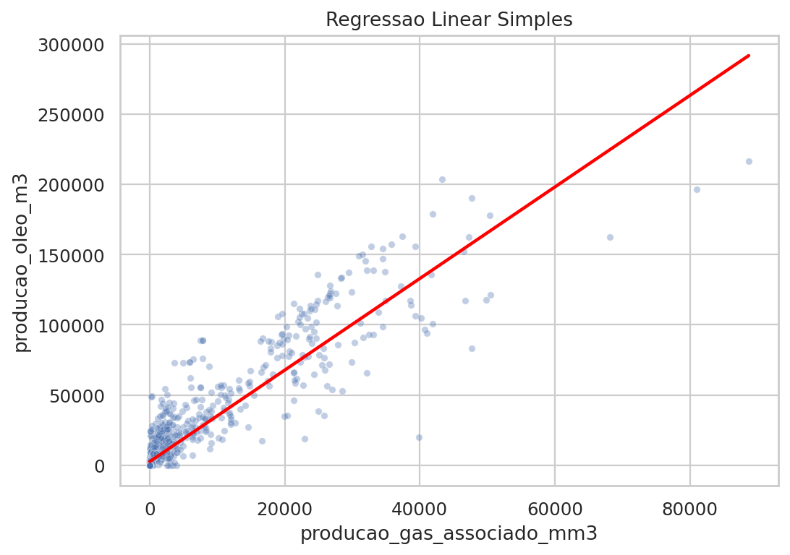

O gráfico mostra a relação entre gás associado e óleo, juntamente com a reta estimada. A inclinação positiva da reta confirma a associação direta entre as duas variáveis.

Ao mesmo tempo, a dispersão dos pontos ao redor da reta mostra que a relação não é perfeita. Existem registros em que a produção de gás associado não explica totalmente a produção de óleo. Essa diferença pode estar ligada a outros fatores da base, como água produzida, ano, injeções e características operacionais — fatores que só a regressão múltipla (Seção 10) é capaz de considerar simultaneamente.

### 9.4 Gráfico de Resíduos

Gráfico gerado: `resultados_ml/regressao_simples_residuos.png`

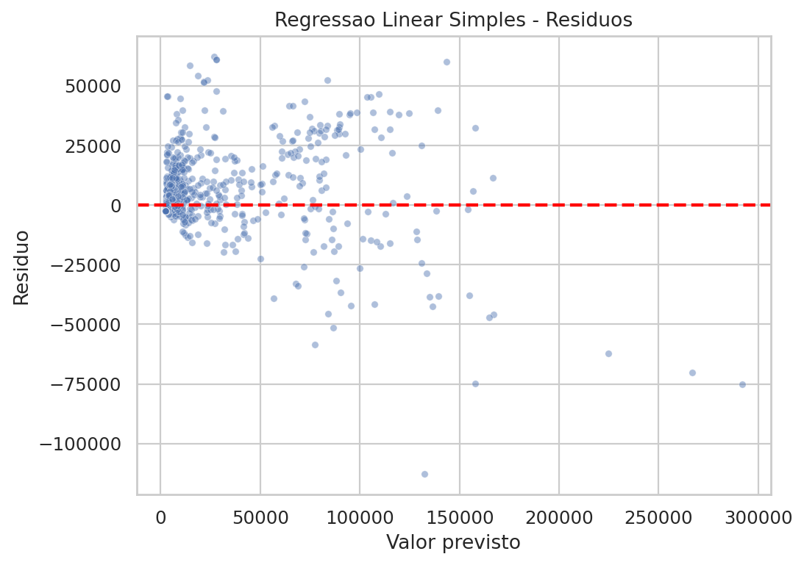

Os resíduos da regressão simples mostram que o modelo captura a tendência geral, mas ainda deixa erros relevantes. Isso é esperado porque apenas uma variável explicativa está sendo usada, ignorando todas as demais informações disponíveis na base.

Esse modelo é importante didaticamente porque evidencia a relação linear principal da base de forma simples e visual. Porém, para previsão mais precisa, modelos com mais variáveis ou com maior flexibilidade tendem a apresentar melhor desempenho, como mostram as próximas seções.

## 10. Modelo 3: Regressão Linear Múltipla

### 10.1 Descrição do Modelo

A Regressão Linear Múltipla amplia a regressão simples, utilizando várias variáveis explicativas ao mesmo tempo, em vez de apenas uma. Ela foi aplicada para prever `producao_oleo_m3` a partir de variáveis de produção, injeção e ano.

A principal vantagem desse modelo é a interpretabilidade: cada coeficiente indica a associação estimada entre uma variável e a produção de óleo, "mantendo as demais constantes" — ou seja, isolando o efeito daquela variável específica do efeito das outras. É como comparar dois registros que são idênticos em todos os aspectos, exceto em uma única variável, e observar a diferença esperada na produção de óleo entre eles.

### 10.2 Resultados da Regressão Múltipla

| Métrica     |         Valor |
| ----------- | ------------: |
| MSE         | 93.978.782,67 |
| RMSE        |      9.694,27 |
| MAE         |      4.331,47 |
| R²          |        0,8463 |
| R² ajustado |        0,8462 |

O R² de 0,8463 indica que o modelo explicou aproximadamente 84,63% da variação da produção de óleo. O R² ajustado foi 0,8462, praticamente igual ao R². Como explicado no glossário (Seção 3), isso é um sinal positivo: a inclusão do conjunto de variáveis não parece ter inflado artificialmente o desempenho do modelo. Ainda assim, a contribuição individual de cada variável deve ser avaliada com os coeficientes, erros padrão e p-valores, e não apenas pelo R² ajustado.

A regressão múltipla superou a regressão simples (R² subiu de 0,8379 para 0,8463), mas não superou o KNN (R² de 0,9016). Isso sugere que adicionar variáveis melhora o modelo linear, mas ainda existem relações locais ou não lineares — relações que não seguem uma linha reta — que o KNN consegue capturar melhor, exatamente por não impor uma forma fixa de equação aos dados.

### 10.3 Coeficientes, Erros Padrão e p-valores

Arquivo gerado: `resultados_ml/coeficientes_regressao_multipla.csv`

| Variável                                 | Coeficiente | Erro padrão |  p-valor |
| ---------------------------------------- | ----------: | ----------: | -------: |
| const                                    |  161.455,52 |   19.490,48 | aprox. 0 |
| `injecao_nitrogenio_mm3`                 |     -456,96 |      142,76 |  0,00137 |
| `ano`                                    |      -78,90 |        9,65 | aprox. 0 |
| `injecao_polimeros_m3`                   |      -14,15 |       24,21 |  0,55888 |
| `producao_gas_associado_mm3`             |      3,2499 |      0,0038 |  0,00000 |
| `producao_condensado_m3`                 |     -0,2375 |      0,1233 |  0,05402 |
| `producao_agua_m3`                       |      0,1367 |      0,0017 |  0,00000 |
| `producao_gas_nao_associado_mm3`         |     -0,0615 |      0,0170 |  0,00029 |
| `injecao_gas_mm3`                        |     -0,0411 |      0,0074 | aprox. 0 |
| `injecao_gas_carbonico_mm3`              |      0,0331 |      0,0239 |  0,16549 |
| `injecao_agua_descarte_m3`               |     -0,0167 |      0,0120 |  0,16547 |
| `injecao_agua_recuperacao_secundaria_m3` |     -0,0152 |      0,0007 | aprox. 0 |

Como explicado no glossário, um p-valor baixo é interpretado como evidência de que aquela variável tem, de fato, uma associação estatística com a produção de óleo, e não apenas uma coincidência dos dados observados. Olhando a tabela com esse critério em mente:

O coeficiente de `producao_gas_associado_mm3` foi positivo e altamente significativo (p-valor praticamente zero). Esse resultado confirma a importância dessa variável mesmo quando as demais variáveis estão no modelo — ela continua sendo, de longe, a mais relevante.

`producao_agua_m3` também apresentou coeficiente positivo e p-valor muito baixo. Isso sugere que maiores volumes de água produzida estão associados a registros de maior escala produtiva. Em campos de petróleo, a produção de água pode crescer junto com a produção total, especialmente em determinados estágios de operação.

`injecao_agua_recuperacao_secundaria_m3` apresentou coeficiente negativo e p-valor muito baixo. Esse resultado deve ser interpretado como associação estatística, não causalidade — isto é, o modelo não prova que injetar mais água reduz a produção de óleo, apenas que essas duas variáveis aparecem associadas negativamente nos dados observados. Pode ser que esse tipo de injeção esteja mais presente em campos maduros ou em condições operacionais específicas, onde a produção de óleo já apresenta outro comportamento por razões que o modelo não captura diretamente.

`injecao_polimeros_m3`, `injecao_gas_carbonico_mm3` e `injecao_agua_descarte_m3` apresentaram p-valores altos (0,559, 0,165 e 0,165, respectivamente). Isso indica que, dentro deste modelo linear e controlando pelas outras variáveis, não há evidência estatística forte de contribuição individual dessas variáveis — elas podem estar presentes no modelo sem agregar muito poder explicativo próprio, ainda que isso não signifique necessariamente que sejam irrelevantes no contexto operacional real.

Uma verificação estatística adicional incluída no código é o cálculo do Fator de Inflação da Variância (VIF, na sigla em inglês), que mede o quanto cada variável explicativa está correlacionada com as demais. Valores de VIF acima de 5 costumam ser considerados motivo de atenção, e valores acima de 10 indicam multicolinearidade severa (quando duas ou mais variáveis carregam informação tão parecida que fica difícil separar o efeito de cada uma). Desconsiderando a constante do modelo, o maior VIF encontrado foi de aproximadamente 4,34 (para `injecao_gas_mm3`), seguido de 4,31 (para `injecao_gas_carbonico_mm3`); todas as demais variáveis ficaram com VIF abaixo de 2,1. Isso indica que, apesar de algumas variáveis de gás estarem moderadamente correlacionadas entre si — o que é esperado, já que ambas envolvem volumes de gás manuseados na mesma instalação —, não há evidência de multicolinearidade severa que comprometa a interpretação dos coeficientes apresentados.

### 10.4 Gráfico Real vs. Previsto

Gráfico gerado: `resultados_ml/regressao_multipla_real_vs_previsto.png`

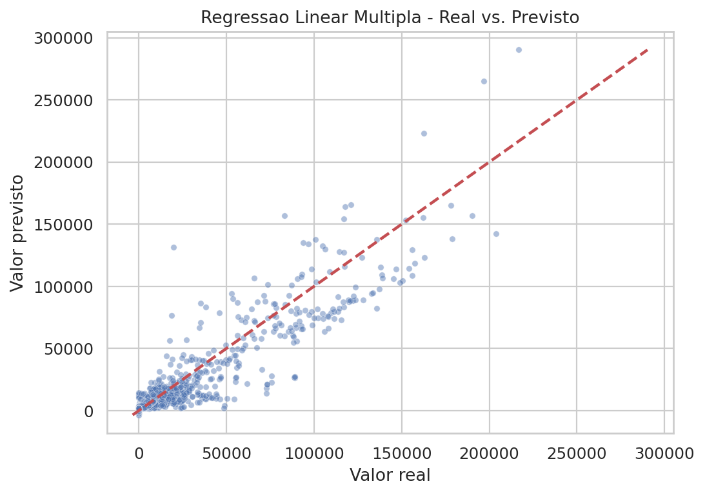

O gráfico mostra bom alinhamento geral entre valores reais e previstos. A regressão múltipla consegue acompanhar a tendência principal da produção de óleo.

Entretanto, alguns pontos se afastam da diagonal, principalmente em faixas de produção mais elevadas. Isso reforça a limitação do modelo linear diante de uma base com distribuição assimétrica e valores extremos, como discutido na Seção 7.

### 10.5 Gráfico de Resíduos

Gráfico gerado: `resultados_ml/regressao_multipla_residuos.png`

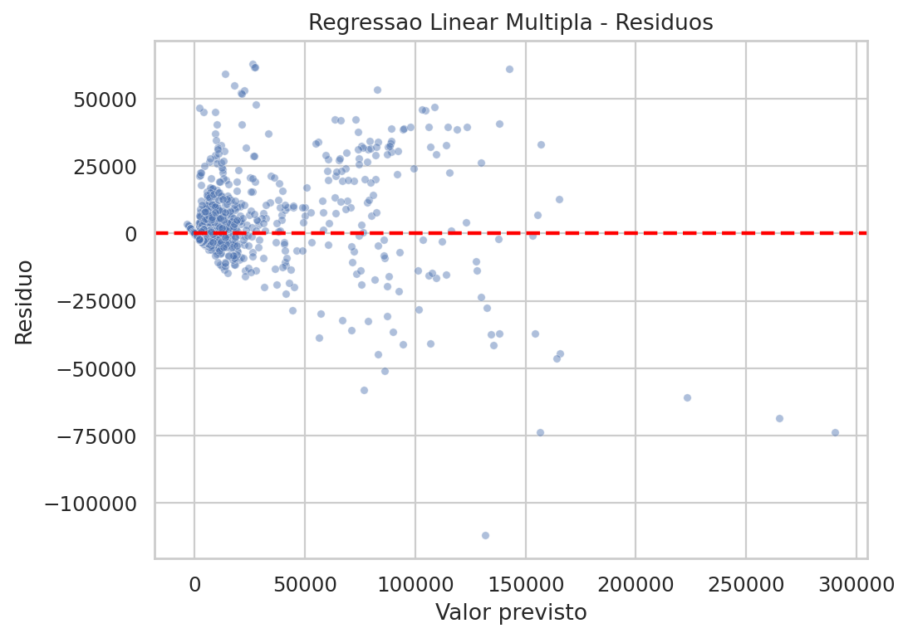

Os resíduos da regressão múltipla ficam melhor distribuídos do que os da regressão simples, pois o modelo usa mais variáveis para explicar a produção de óleo. Mesmo assim, ainda há dispersão relevante em valores previstos mais altos, repetindo o padrão de heterocedasticidade já observado no KNN.

Isso mostra que a regressão múltipla é interpretável e tem bom ajuste, mas não captura totalmente todos os padrões presentes nos dados — especialmente aqueles que não seguem uma relação linear.

## 11. Modelo 4: Regressão Logística

### 11.1 Descrição do Modelo

A Regressão Logística foi aplicada para classificação binária (apenas duas categorias possíveis). A pergunta respondida pelo modelo foi:

O registro apresenta produção positiva de óleo?

A variável alvo foi:

`produziu_oleo = 1` se `producao_oleo_m3 > 0`

`produziu_oleo = 0` se `producao_oleo_m3 = 0`

Apesar do nome "regressão", esse modelo não estima um valor numérico contínuo: ele estima a probabilidade de um registro pertencer à classe 1 (produziu óleo), usando uma curva em forma de "S" (chamada função sigmoide) que transforma qualquer combinação de variáveis explicativas em um número entre 0 e 1. Se essa probabilidade for maior que um limiar (por padrão, 0,5), o modelo classifica o registro como "produziu óleo"; caso contrário, como "não produziu".

Distribuição das classes na base completa:

| Classe | Significado       | Quantidade |
| -----: | ----------------- | ---------: |
|      0 | Não produziu óleo |     96.443 |
|      1 | Produziu óleo     |     92.485 |

As classes estão relativamente equilibradas, o que torna a avaliação mais confiável (modelos de classificação tendem a ter dificuldades extras quando uma classe é muito mais rara que a outra). Mesmo assim, foi usado `class_weight="balanced"`, uma opção que ajusta o treinamento para dar peso equivalente às duas classes, reduzindo possíveis efeitos de desbalanceamento residual.

### 11.2 Resultados da Regressão Logística

Arquivo gerado: `resultados_ml/resumo_modelo_logistico.csv`

| Métrica  |  Valor |
| -------- | -----: |
| Acurácia | 0,9205 |
| Precisão | 0,9951 |
| Recall   | 0,8417 |
| F1-score | 0,9120 |
| AUC      | 0,9859 |

A acurácia de 92,05% indica que o modelo classificou corretamente cerca de 92% dos registros do conjunto de teste.

A precisão de 99,51% é extremamente alta. Lembrando do exemplo do filtro de spam (Seção 6.2): isso significa que, quando o modelo previu que havia produção positiva, ele quase sempre acertou. Em outras palavras, o número de falsos positivos foi muito pequeno — o modelo raramente "soa um alarme" de produção sem motivo.

O recall de 84,17% indica que o modelo encontrou cerca de 84% dos registros que realmente tinham produção positiva. Esse valor é bom, mas mostra que ainda existem falsos negativos: alguns registros que de fato produziram óleo foram classificados, erradamente, como "sem produção".

O F1-score de 91,20% mostra bom equilíbrio geral entre precisão e recall. A AUC de 0,9859 indica excelente capacidade de separação entre registros com e sem produção de óleo — bem próxima do valor máximo possível (1,0).

### 11.3 Matriz de Confusão

Gráfico gerado: `resultados_ml/logistica_matriz_confusao.png`

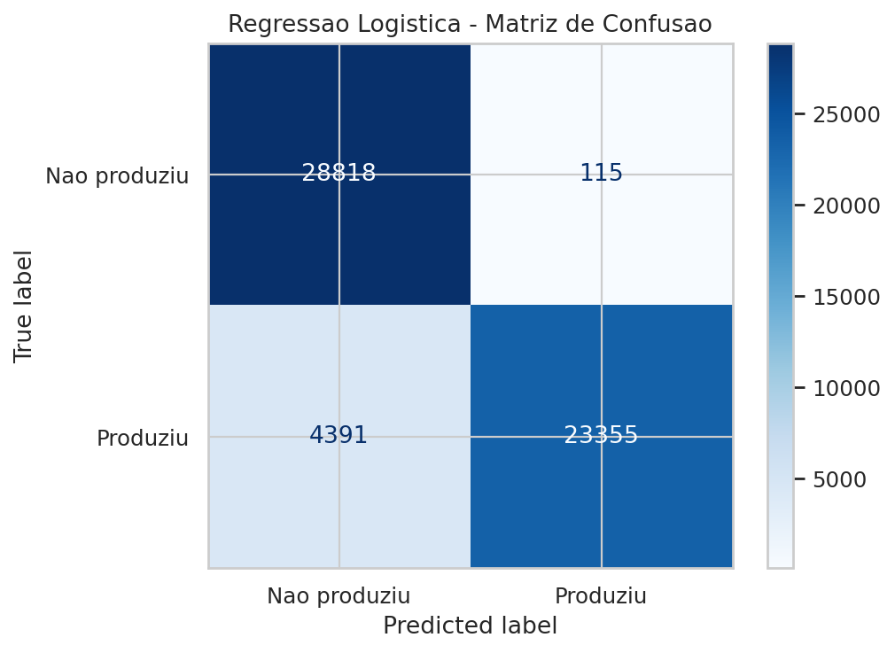

Matriz de confusão no conjunto de teste:

|                    | Previsto: não produziu | Previsto: produziu |
| ------------------ | ---------------------: | -----------------: |
| Real: não produziu |                 28.818 |                115 |
| Real: produziu     |                  4.391 |             23.355 |

Interpretação:

- Verdadeiros negativos: 28.818 registros sem produção foram corretamente classificados como sem produção.
- Falsos positivos: 115 registros sem produção foram classificados incorretamente como produtores.
- Falsos negativos: 4.391 registros com produção foram classificados como sem produção.
- Verdadeiros positivos: 23.355 registros com produção foram corretamente identificados.

O modelo é conservador ao prever a classe positiva: ele só "aposta" em produção positiva quando está bastante confiante, e por isso quase sempre acerta quando o faz (precisão altíssima). Por outro lado, essa cautela tem um custo: uma parte dos registros que realmente produziram óleo (4.391 deles) foi classificada como não produtora.

Em um cenário hipotético de uso prático — por exemplo, se uma equipe usasse esse modelo apenas para decidir quais poços merecem inspeção prioritária —, esse comportamento conservador seria vantajoso para evitar inspeções desnecessárias (poucos falsos alarmes), mas poderia significar deixar alguns poços produtivos sem a atenção devida (recall imperfeito). Se o objetivo prático fosse evitar falsos alarmes de produção, esse comportamento seria muito bom. Se o objetivo fosse identificar todos os casos positivos, seria necessário ajustar o limiar de decisão (o valor de corte da probabilidade, hoje fixado em 0,5) para aumentar o recall, mesmo que isso custasse um pouco de precisão.

### 11.4 Curva ROC

Gráfico gerado: `resultados_ml/logistica_roc.png`

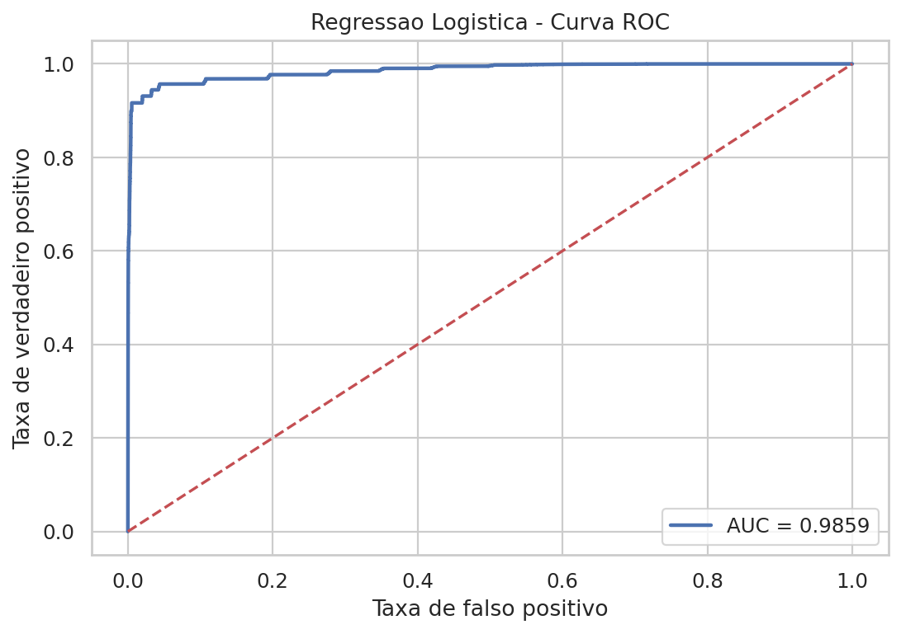

A curva ROC mostra o desempenho da classificação em diferentes limiares de decisão, e não apenas no limiar padrão de 0,5 usado na matriz de confusão acima. A AUC de 0,9859 indica que o modelo separa muito bem as duas classes, independentemente de qual limiar específico seja escolhido.

Esse resultado é coerente com a estrutura da base, pois registros com produção positiva tendem a apresentar comportamento diferente em variáveis como gás associado, água e injeções — as mesmas variáveis que já se mostraram relevantes nos modelos de regressão das seções anteriores.

## 12. Comparação Geral dos Modelos

### 12.1 Comparação dos Modelos de Regressão

Arquivo gerado: `resultados_ml/resumo_modelos_regressao.csv`

| Modelo                    |           MSE |     RMSE |      MAE |     R2 | R2 ajustado |
| ------------------------- | ------------: | -------: | -------: | -----: | ----------: |
| KNN Regressor             | 60.163.973,53 | 7.756,54 | 2.582,79 | 0,9016 |           - |
| Regressao Linear Simples  | 99.101.826,61 | 9.954,99 | 4.961,47 | 0,8379 |           - |
| Regressao Linear Multipla | 93.978.782,67 | 9.694,27 | 4.331,47 | 0,8463 |      0,8462 |

O KNN apresentou o melhor desempenho geral. Ele teve o menor MSE, menor RMSE, menor MAE e maior R². Isso sugere que a base possui padrões locais ou relações não lineares que são melhor capturadas por um modelo baseado em vizinhos do que por uma equação linear fixa.

A Regressão Linear Simples teve o menor desempenho entre os modelos de regressão, mas ainda apresentou R² alto. Esse resultado reforça a força explicativa de `producao_gas_associado_mm3`, mesmo isolada das demais variáveis.

A Regressão Linear Múltipla melhorou em relação à simples e permitiu analisar o papel de várias variáveis. Mesmo não sendo a melhor em erro preditivo, ela é muito valiosa para interpretação, já que é o único modelo, entre os três, que produz coeficientes, erros padrão e p-valores claros para cada variável.

Em resumo, há uma troca (_trade-off_) entre desempenho preditivo e interpretabilidade: o KNN prevê melhor, mas não explica por quê; a regressão múltipla explica bem, mas prevê um pouco pior. A escolha entre um e outro, na prática, depende do objetivo: se o que importa é o número final previsto, o KNN é preferível; se o que importa é entender quais variáveis influenciam a produção e em que direção, a regressão múltipla é mais útil.

### 12.2 Comparação entre Regressão e Classificação

Os modelos de regressão e classificação não devem ser comparados diretamente, pois resolvem problemas diferentes.

Os modelos de regressão respondem:

Quanto óleo será produzido?

A Regressão Logística responde:

Houve produção positiva de óleo?

Por isso, as métricas também são diferentes. R², MSE, RMSE e MAE avaliam previsão numérica. Acurácia, precisão, recall, F1 e AUC avaliam classificação. Comparar, por exemplo, o R² do KNN com a acurácia da regressão logística não faria sentido, pois cada métrica está medindo coisas conceitualmente distintas.

## 13. Análise Crítica

Os resultados são consistentes com os conceitos trabalhados nas aulas. O projeto aplicou um fluxo completo de aprendizado de máquina:

- exploração e visualização dos dados;
- tratamento de dados numéricos;
- remoção de variáveis constantes;
- divisão treino/teste;
- padronização quando necessária;
- treinamento de modelos;
- avaliação com métricas adequadas;
- interpretação de gráficos e resíduos.

O uso do KNN está alinhado com a necessidade de padronizar variáveis e testar diferentes valores de `k`. A escolha de `k = 11` foi baseada em validação cruzada, e não escolhida arbitrariamente.

A Regressão Linear Simples está bem justificada porque usa a variável mais correlacionada com a produção de óleo. Isso fortalece a análise e demonstra coerência entre análise exploratória e modelagem.

A Regressão Linear Múltipla atende ao objetivo de avaliar múltiplos preditores simultaneamente. O uso de R² ajustado, erro padrão, p-valores e, agora, do diagnóstico de VIF (Seção 10.3) torna a discussão mais completa, pois permite avaliar tanto desempenho quanto significância e estabilidade estatística.

A Regressão Logística foi aplicada corretamente a um alvo binário. A matriz de confusão e a curva ROC tornam a avaliação mais robusta do que usar apenas acurácia.

Apesar dos bons resultados, algumas limitações devem ser destacadas:

1. **Distribuição assimétrica da variável alvo.** A base possui muitos registros com produção zero. Isso torna a distribuição da variável alvo assimétrica e penaliza métricas sensíveis a valores extremos, como o MSE.

2. **Forte dependência de uma única variável.** A variável `producao_gas_associado_mm3` tem correlação muito alta com `producao_oleo_m3`. Isso ajuda os modelos, mas também significa que parte do desempenho vem de uma variável muito próxima do processo físico de produção de óleo, e não de uma descoberta sutil dos modelos.

3. **Associação, não causalidade.** Os modelos indicam associação estatística, não causalidade. Um coeficiente negativo não prova que a variável reduz a produção; ele mostra apenas a relação estatística estimada dentro do modelo, que pode ter outras explicações (por exemplo, variáveis omitidas que afetam ambas ao mesmo tempo).

4. **Suposição de linearidade.** A Regressão Linear Simples e a Múltipla assumem relações lineares entre as variáveis. Como os dados reais podem ter relações não lineares (algo que o desempenho superior do KNN sugere), isso limita parte do desempenho desses dois modelos.

5. **Custo computacional e interpretabilidade do KNN.** O KNN teve melhor desempenho, mas é menos interpretável que os modelos lineares (não há coeficientes para examinar) e possui maior custo computacional em bases grandes, pois precisa comparar cada novo registro com uma grande quantidade de registros de treino.

6. **Simplificação do alvo binário.** A escolha do alvo binário da Regressão Logística simplifica o problema. Ela distingue produção zero de produção positiva, mas não diferencia produção baixa de produção alta, perdendo parte da informação que os modelos de regressão conseguem capturar.

7. **Divisão treino/teste aleatória em dados com estrutura temporal.** Como mencionado na Seção 5, a base tem natureza temporal (`ano`, `mes_ano`), mas a separação entre treino e teste foi feita de forma aleatória, e não respeitando a ordem cronológica. Isso pode permitir que o modelo "veja", durante o treino, padrões de meses posteriores ao período de teste, o que normalmente não estaria disponível em um cenário real de previsão (onde só se conhece o passado para prever o futuro). Esse ponto não invalida os resultados aqui apresentados, mas é uma simplificação típica de trabalhos introdutórios que merece atenção em aplicações com fins de previsão real.

8. **Uso de variáveis contemporâneas de produção.** Variáveis como `producao_gas_associado_mm3`, `producao_gas_nao_associado_mm3`, `producao_condensado_m3` e `producao_agua_m3` pertencem ao mesmo registro temporal da produção de óleo. Portanto, os resultados devem ser interpretados como modelagem supervisionada e análise de associação entre volumes do mesmo período, não como uma previsão operacional feita antes de esses volumes serem conhecidos. Para previsão futura real, seria necessário usar apenas informações disponíveis antes do período previsto ou criar defasagens temporais.

9. **Amostragem na validação cruzada do KNN.** A escolha do melhor `k` foi feita usando uma amostra do conjunto de treino, e não a base de treino inteira, por razões de custo computacional (explicado na Seção 5). Embora essa prática seja comum e razoável, ela introduz uma pequena fonte adicional de variabilidade na escolha de `k`, que poderia, em tese, levar a um valor levemente diferente caso toda a base de treino fosse usada.

10. **Ausência de tratamento explícito de valores extremos (outliers).** Nenhuma técnica específica de remoção ou atenuação de valores extremos foi aplicada antes da modelagem. Dado o impacto desses valores sobre o MSE, discutido ao longo do relatório, essa é uma frente natural de investigação futura, detalhada na próxima seção.

11. **Multicolinearidade moderada entre variáveis de gás.** O diagnóstico de VIF apresentado na Seção 10.3 mostrou que as variáveis `injecao_gas_mm3` e `injecao_gas_carbonico_mm3` apresentam a maior correlação com as demais variáveis explicativas (VIF de aproximadamente 4,34 e 4,31, respectivamente), embora ainda dentro de um intervalo considerado aceitável. Isso sugere que, com cautela, os coeficientes da regressão múltipla podem ser interpretados individualmente, mas reforça a importância de não tratá-los como medidas isoladas e definitivas de causalidade.

## 14. Recomendações para Trabalhos Futuros

A partir das limitações discutidas na Seção 13, algumas direções poderiam aprofundar e fortalecer esta análise em trabalhos futuros:

**Transformação da variável alvo.** Aplicar uma transformação logarítmica (por exemplo, `log(1 + producao_oleo_m3)`) antes de treinar os modelos de regressão poderia reduzir o impacto da assimetria e dos valores extremos discutidos na Seção 4, tornando a distribuição da variável alvo mais próxima de uma distribuição normal e, possivelmente, melhorando o ajuste dos modelos lineares.

**Modelos baseados em árvores.** Algoritmos como Random Forest ou Gradient Boosting (por exemplo, XGBoost ou LightGBM) lidam naturalmente com relações não lineares e com variáveis em escalas diferentes, sem exigir padronização. Eles também costumam oferecer uma medida de importância de variáveis, o que poderia complementar a interpretabilidade da regressão múltipla com uma abordagem não linear.

**Regularização na regressão múltipla.** Técnicas como Ridge ou Lasso adicionam uma penalização aos coeficientes da regressão, o que pode tornar as estimativas mais estáveis em presença de variáveis correlacionadas (como discutido no diagnóstico de VIF) e ajudar a identificar quais variáveis realmente merecem permanecer no modelo.

**Validação respeitando a ordem temporal.** Como apontado na limitação 7 da Seção 13, uma divisão treino/teste baseada em tempo (por exemplo, treinar com dados até 2024 e testar com 2025-2026) ofereceria uma avaliação mais realista da capacidade de previsão do modelo em um cenário de uso futuro genuíno.

**Criação de variáveis defasadas para previsão temporal.** Para aproximar o problema de uma previsão operacional real, seria possível criar variáveis com defasagem temporal, usando informações de meses anteriores para prever a produção de meses posteriores. Isso reduziria o risco de usar informações do mesmo período que, em uma aplicação prática, talvez ainda não estivessem disponíveis.

**Tratamento de valores extremos.** Investigar tratamentos específicos para os registros de produção muito alta — como capeamento de valores extremos (winsorização) ou modelagem separada para os casos de produção elevada — poderia reduzir o impacto desses pontos sobre o MSE e melhorar a estabilidade das previsões.

**Ajuste do limiar de decisão na Regressão Logística.** Como discutido na Seção 11.3, explorar diferentes limiares de decisão (em vez do padrão de 0,5) permitiria estudar o equilíbrio entre precisão e recall de forma mais flexível, conforme o objetivo prático de uso do modelo.

**Validação cruzada do KNN na base de treino completa.** Caso o custo computacional permita, repetir a busca pelo melhor valor de `k` utilizando toda a base de treino (em vez de uma amostra) eliminaria a pequena fonte adicional de variabilidade apontada na limitação 9 da Seção 13.

## 15. Conclusão

O trabalho atingiu seu objetivo de aplicar e interpretar os modelos KNN, Regressão Linear Simples, Regressão Linear Múltipla e Regressão Logística sobre uma base real de produção energética marítima, indo além do simples cálculo de métricas para também discutir o porquê de cada resultado.

Entre os modelos de regressão, o KNN apresentou o melhor resultado, com R² de 0,9016 e MAE de 2.582,79 m³. Isso indica forte capacidade preditiva para estimar a produção de óleo, ao custo de uma interpretabilidade menor.

A Regressão Linear Simples mostrou que a produção de gás associado é uma variável extremamente relevante para explicar a produção de óleo. Mesmo usando apenas essa variável, o modelo atingiu R² de 0,8379.

A Regressão Linear Múltipla apresentou R² de 0,8463 e R² ajustado de 0,8462. Seu maior valor está na interpretação dos coeficientes e na identificação de variáveis estatisticamente relevantes, reforçada pelo diagnóstico de multicolinearidade apresentado neste relatório.

A Regressão Logística apresentou excelente desempenho para classificar registros com e sem produção positiva de óleo, com acurácia de 0,9205, F1-score de 0,9120 e AUC de 0,9859.

De forma geral, os resultados são coerentes e tecnicamente defensáveis. O projeto demonstra bom uso das técnicas estudadas, gera gráficos adequados, compara modelos com métricas apropriadas e reconhece as limitações dos dados e dos métodos — limitações que, longe de invalidar o trabalho, apontam caminhos concretos para aprofundamento em estudos futuros, como discutido na Seção 14.

## 16. Arquivos Gerados

Gráficos:

- `resultados_ml/histograma_producao_oleo.png`
- `resultados_ml/heatmap_correlacao.png`
- `resultados_ml/knn_mse_por_k.png`
- `resultados_ml/knn_real_vs_previsto.png`
- `resultados_ml/knn_residuos.png`
- `resultados_ml/regressao_simples_reta.png`
- `resultados_ml/regressao_simples_residuos.png`
- `resultados_ml/regressao_multipla_real_vs_previsto.png`
- `resultados_ml/regressao_multipla_residuos.png`
- `resultados_ml/logistica_matriz_confusao.png`
- `resultados_ml/logistica_roc.png`

Tabelas:

- `resultados_ml/resumo_modelos_regressao.csv`
- `resultados_ml/resumo_modelo_logistico.csv`
- `resultados_ml/coeficientes_regressao_multipla.csv`
- `resultados_ml/vif_regressao_multipla.csv`
